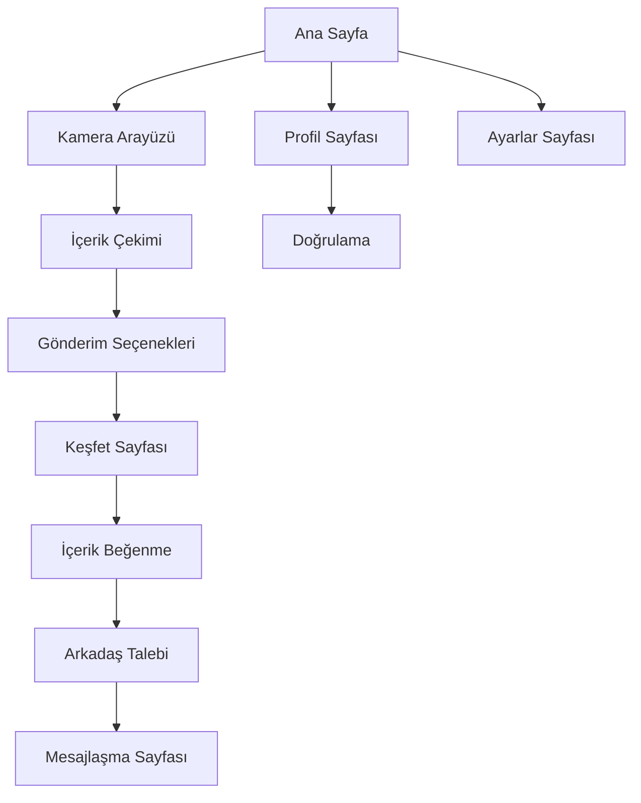

# SendPic - Sosyal Fotoğraf/Video Paylaşım Uygulaması

## 1. Ürün Genel Bakış

SendPic, kullanıcıların kamera ile çektikleri fotoğraf ve videoları anonim olarak rastgele diğer kullanıcılara gönderebileceği sosyal bir paylaşım platformudur. Uygulama, spontane ve otantik içerik paylaşımını teşvik ederken, kullanıcılar arasında yeni bağlantılar kurulmasını sağlar.

- Temel amaç: Gerçek zamanlı, anonim fotoğraf/video paylaşımı ile sosyal etkileşimi artırmak
- Hedef kitle: 18-35 yaş arası sosyal medya kullanıcıları
- Pazar değeri: Spontane içerik paylaşımı ve anonim sosyal etkileşim pazarında yenilikçi bir çözüm

## 2. Temel Özellikler

### 2.1 Kullanıcı Rolleri

| Rol | Kayıt Yöntemi | Temel Yetkiler |
|-----|---------------|----------------|
| Standart Kullanıcı | E-posta/telefon kayıt | Fotoğraf/video çekme, gönderme, profil oluşturma |
| Doğrulanmış Kullanıcı | Kimlik doğrulama süreci | Tüm standart yetkiler + doğrulanmış rozet |
| Premium Kullanıcı | Ücretli üyelik | Sınırsız jeton, gelişmiş filtreler, öncelikli destek |

### 2.2 Özellik Modülü

SendPic uygulaması aşağıdaki ana sayfalardan oluşur:

1. **Ana Sayfa**: Kamera arayüzü, gelen içerikler, navigasyon menüsü
2. **Profil Sayfası**: Kullanıcı bilgileri, ayarlar, jeton durumu, doğrulama rozeti
3. **Mesajlaşma Sayfası**: Özel mesaj kutusu, arkadaş listesi, sohbet geçmişi
4. **Keşfet Sayfası**: Gelen anonim içerikler, beğenme/arkadaş ekleme seçenekleri
5. **Ayarlar Sayfası**: Gizlilik ayarları, bildirim tercihleri, hesap yönetimi

### 2.3 Sayfa Detayları

| Sayfa Adı | Modül Adı | Özellik Açıklaması |
|-----------|-----------|--------------------|
| Ana Sayfa | Kamera Arayüzü | Sadece kamera erişimi, fotoğraf/video çekme, anlık paylaşım |
| Ana Sayfa | Gönderim Seçenekleri | 6-10-100-1000 kişiye gönder seçenekleri, jeton kontrolü |
| Ana Sayfa | İçerik Önizleme | Çekilen içeriği gönderim öncesi görüntüleme |
| Profil Sayfası | Kullanıcı Bilgileri | Ad, yaş, cinsiyet, bio, profil fotoğrafı |
| Profil Sayfası | Doğrulama Sistemi | Kimlik doğrulama, cinsiyet doğrulama, onaylı profil rozeti |
| Profil Sayfası | Jeton Yönetimi | Mevcut jeton sayısı, jeton satın alma, kullanım geçmişi |
| Mesajlaşma Sayfası | Özel Mesajlar | Arkadaşlarla birebir mesajlaşma, medya paylaşımı |
| Mesajlaşma Sayfası | Arkadaş Listesi | Eklenen arkadaşlar, çevrimiçi durumu, hızlı erişim |
| Keşfet Sayfası | Anonim İçerikler | Rastgele gelen fotoğraf/videolar, gönderen kimliği gizli |
| Keşfet Sayfası | Etkileşim Seçenekleri | Beğenme, arkadaş ekleme talebi, içerik raporlama |
| Ayarlar Sayfası | Gizlilik Kontrolü | İçerik alma tercihleri, engelleme listesi |
| Ayarlar Sayfası | Hesap Yönetimi | Şifre değiştirme, hesap silme, veri dışa aktarma |

## 3. Temel Süreçler

**Standart Kullanıcı Akışı:**
1. Kullanıcı uygulamaya giriş yapar
2. Ana sayfada kamera ile fotoğraf/video çeker
3. Gönderim seçeneğini belirler (6-10-100-1000 kişi)
4. Jeton kontrolü yapılır ve içerik rastgele kullanıcılara gönderilir
5. Keşfet sayfasında gelen anonim içerikleri görüntüler
6. Beğendiği içeriklerin sahiplerine arkadaş talebi gönderir
7. Kabul edilen arkadaşlarla özel mesajlaşma başlar

**Doğrulama Süreci:**
1. Kullanıcı profil ayarlarından doğrulama talebinde bulunur
2. Kimlik belgesi ve selfie fotoğrafı yükler
3. Sistem otomatik doğrulama yapar
4. Onaylanan kullanıcıya doğrulanmış rozet verilir

## 4. Kullanıcı Arayüzü Tasarımı

### 4.1 Tasarım Stili

- **Ana renkler**: Birincil: #FF6B6B (Coral), İkincil: #4ECDC4 (Teal)
- **Buton stili**: Yuvarlatılmış köşeli, gölgeli 3D efekt
- **Font**: Roboto, ana başlıklar 24px, içerik metni 16px
- **Layout stili**: Kart tabanlı tasarım, alt navigasyon menüsü
- **İkon stili**: Outline tarzı ikonlar, emoji desteği

### 4.2 Sayfa Tasarım Genel Bakışı

| Sayfa Adı | Modül Adı | UI Elementleri |
|-----------|-----------|----------------|
| Ana Sayfa | Kamera Arayüzü | Tam ekran kamera görünümü, çekim butonu (beyaz daire), gönderim seçenekleri (alt panel) |
| Ana Sayfa | Gönderim Paneli | Jeton sayacı (üst sağ), gönderim butonları (6-10-100-1000), progress bar |
| Profil Sayfası | Kullanıcı Kartı | Profil fotoğrafı (daire), doğrulama rozeti (mavi tik), bio alanı (gri kutu) |
| Profil Sayfası | Jeton Paneli | Jeton ikonu, sayı göstergesi, satın alma butonu (yeşil) |
| Keşfet Sayfası | İçerik Kartları | Tam ekran medya görünümü, beğeni butonu (kalp), arkadaş ekleme (artı) |
| Mesajlaşma Sayfası | Sohbet Listesi | Arkadaş avatarları, son mesaj önizlemesi, çevrimiçi göstergesi (yeşil nokta) |

### 4.3 Responsive Tasarım

Uygulama mobile-first yaklaşımla tasarlanmış olup, dokunmatik etkileşim optimizasyonu içerir. Progressive Web App (PWA) teknolojisi ile native app deneyimi sunar.