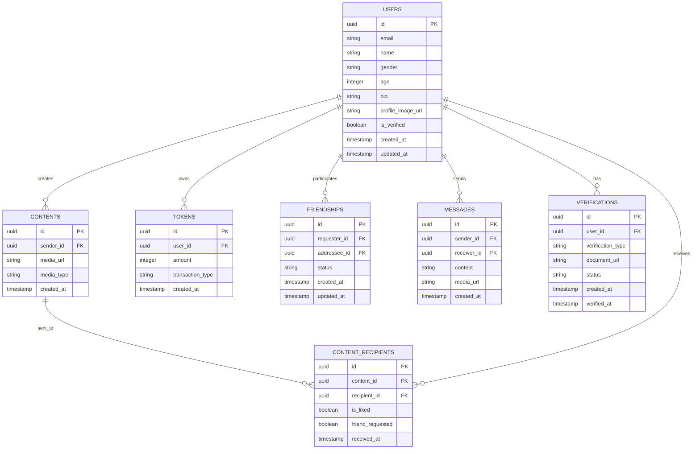

# SendPic - Teknik Mimari Belgesi

## 1. Mimari Tasarım

```mermaid
graph TD
  A[Kullanıcı Tarayıcısı] --> B[React PWA Uygulaması]
  B --> C[Supabase SDK]
  C --> D[Supabase Servisleri]
  B --> E[Kamera API]
  B --> F[Push Notification API]
  
  subgraph "Frontend Katmanı"
    B
    E
    F
  end
  
  subgraph "Backend Katmanı (Supabase)"
    D
    G[PostgreSQL Veritabanı]
    H[Storage (Medya Dosyaları)]
    I[Auth (Kimlik Doğrulama)]
    J[Realtime (Canlı Mesajlaşma)]
  end
  
  D --> G
  D --> H
  D --> I
  D --> J
```

## 2. Teknoloji Açıklaması

- **Frontend**: React@18 + TypeScript + Tailwind CSS + Vite + PWA
- **Backend**: Supabase (PostgreSQL + Auth + Storage + Realtime)
- **Kamera Erişimi**: MediaDevices API + getUserMedia
- **Bildirimler**: Web Push Notifications API
- **Offline Destek**: Service Worker + IndexedDB

## 3. Route Tanımları

| Route | Amaç |
|-------|------|
| / | Ana sayfa, kamera arayüzü ve içerik çekimi |
| /discover | Keşfet sayfası, gelen anonim içerikleri görüntüleme |
| /profile | Kullanıcı profil sayfası, ayarlar ve doğrulama |
| /messages | Mesajlaşma sayfası, arkadaşlarla sohbet |
| /chat/:friendId | Birebir sohbet sayfası |
| /settings | Uygulama ayarları ve gizlilik kontrolü |
| /auth/login | Giriş sayfası |
| /auth/register | Kayıt sayfası |
| /auth/verify | Kimlik doğrulama sayfası |

## 4. API Tanımları

### 4.1 Temel API

**Kullanıcı Kimlik Doğrulama**
```
POST /auth/v1/signup
```

İstek:
| Parametre Adı | Parametre Tipi | Zorunlu | Açıklama |
|---------------|----------------|---------|----------|
| email | string | true | Kullanıcı e-posta adresi |
| password | string | true | Şifre (minimum 8 karakter) |
| metadata | object | false | Ek kullanıcı bilgileri |

Yanıt:
| Parametre Adı | Parametre Tipi | Açıklama |
|---------------|----------------|-----------|
| user | object | Kullanıcı bilgileri |
| session | object | Oturum bilgileri |

Örnek:
```json
{
  "email": "user@example.com",
  "password": "securepassword",
  "metadata": {
    "name": "John Doe",
    "age": 25,
    "gender": "male"
  }
}
```

**İçerik Yükleme**
```
POST /storage/v1/object/media
```

İstek:
| Parametre Adı | Parametre Tipi | Zorunlu | Açıklama |
|---------------|----------------|---------|----------|
| file | File | true | Fotoğraf veya video dosyası |
| bucket | string | true | Storage bucket adı |

Yanıt:
| Parametre Adı | Parametre Tipi | Açıklama |
|---------------|----------------|-----------|
| path | string | Dosya yolu |
| fullPath | string | Tam dosya URL'i |

**Rastgele İçerik Gönderimi**
```
POST /rest/v1/rpc/send_random_content
```

İstek:
| Parametre Adı | Parametre Tipi | Zorunlu | Açıklama |
|---------------|----------------|---------|----------|
| content_url | string | true | Medya dosyası URL'i |
| recipient_count | integer | true | Gönderilecek kişi sayısı (6,10,100,1000) |
| sender_id | uuid | true | Gönderen kullanıcı ID'si |

Yanıt:
| Parametre Adı | Parametre Tipi | Açıklama |
|---------------|----------------|-----------|
| success | boolean | İşlem durumu |
| sent_count | integer | Başarıyla gönderilen sayı |
| remaining_tokens | integer | Kalan jeton sayısı |

## 5. Sunucu Mimarisi


## 6. Veri Modeli

### 6.1 Veri Modeli Tanımı



### 6.2 Veri Tanımlama Dili

**Kullanıcılar Tablosu (users)**
```sql
-- Tablo oluşturma
CREATE TABLE users (
    id UUID PRIMARY KEY DEFAULT gen_random_uuid(),
    email VARCHAR(255) UNIQUE NOT NULL,
    name VARCHAR(100) NOT NULL,
    gender VARCHAR(10) CHECK (gender IN ('male', 'female', 'other')),
    age INTEGER CHECK (age >= 18 AND age <= 100),
    bio TEXT,
    profile_image_url TEXT,
    is_verified BOOLEAN DEFAULT false,
    created_at TIMESTAMP WITH TIME ZONE DEFAULT NOW(),
    updated_at TIMESTAMP WITH TIME ZONE DEFAULT NOW()
);

-- İndeks oluşturma
CREATE INDEX idx_users_email ON users(email);
CREATE INDEX idx_users_is_verified ON users(is_verified);
CREATE INDEX idx_users_created_at ON users(created_at DESC);

-- RLS (Row Level Security) politikaları
ALTER TABLE users ENABLE ROW LEVEL SECURITY;

CREATE POLICY "Users can view their own profile" ON users
    FOR SELECT USING (auth.uid() = id);

CREATE POLICY "Users can update their own profile" ON users
    FOR UPDATE USING (auth.uid() = id);

-- Yetkiler
GRANT SELECT ON users TO anon;
GRANT ALL PRIVILEGES ON users TO authenticated;
```

**İçerikler Tablosu (contents)**
```sql
-- Tablo oluşturma
CREATE TABLE contents (
    id UUID PRIMARY KEY DEFAULT gen_random_uuid(),
    sender_id UUID REFERENCES users(id) ON DELETE CASCADE,
    media_url TEXT NOT NULL,
    media_type VARCHAR(20) CHECK (media_type IN ('image', 'video')),
    created_at TIMESTAMP WITH TIME ZONE DEFAULT NOW()
);

-- İndeks oluşturma
CREATE INDEX idx_contents_sender_id ON contents(sender_id);
CREATE INDEX idx_contents_created_at ON contents(created_at DESC);

-- RLS politikaları
ALTER TABLE contents ENABLE ROW LEVEL SECURITY;

CREATE POLICY "Users can create content" ON contents
    FOR INSERT WITH CHECK (auth.uid() = sender_id);

CREATE POLICY "Users can view content sent to them" ON contents
    FOR SELECT USING (
        EXISTS (
            SELECT 1 FROM content_recipients 
            WHERE content_id = contents.id 
            AND recipient_id = auth.uid()
        )
    );

-- Yetkiler
GRANT SELECT ON contents TO authenticated;
GRANT INSERT ON contents TO authenticated;
```

**Jeton Sistemi (tokens)**
```sql
-- Tablo oluşturma
CREATE TABLE tokens (
    id UUID PRIMARY KEY DEFAULT gen_random_uuid(),
    user_id UUID REFERENCES users(id) ON DELETE CASCADE,
    amount INTEGER NOT NULL,
    transaction_type VARCHAR(20) CHECK (transaction_type IN ('earned', 'spent', 'purchased')),
    created_at TIMESTAMP WITH TIME ZONE DEFAULT NOW()
);

-- İndeks oluşturma
CREATE INDEX idx_tokens_user_id ON tokens(user_id);
CREATE INDEX idx_tokens_created_at ON tokens(created_at DESC);

-- Başlangıç verileri
INSERT INTO tokens (user_id, amount, transaction_type)
SELECT id, 50, 'earned' FROM users WHERE created_at >= NOW() - INTERVAL '1 day';

-- Yetkiler
GRANT SELECT ON tokens TO authenticated;
GRANT INSERT ON tokens TO authenticated;
```

**Rastgele İçerik Dağıtım Fonksiyonu**
```sql
CREATE OR REPLACE FUNCTION send_random_content(
    p_content_id UUID,
    p_recipient_count INTEGER,
    p_sender_id UUID
)
RETURNS JSON AS $$
DECLARE
    v_user_tokens INTEGER;
    v_required_tokens INTEGER;
    v_recipients UUID[];
    v_recipient UUID;
BEGIN
    -- Jeton kontrolü
    SELECT COALESCE(SUM(amount), 0) INTO v_user_tokens
    FROM tokens WHERE user_id = p_sender_id;
    
    v_required_tokens := CASE p_recipient_count
        WHEN 6 THEN 1
        WHEN 10 THEN 2
        WHEN 100 THEN 10
        WHEN 1000 THEN 50
        ELSE 0
    END;
    
    IF v_user_tokens < v_required_tokens THEN
        RETURN json_build_object('success', false, 'error', 'Insufficient tokens');
    END IF;
    
    -- Rastgele kullanıcı seçimi
    SELECT ARRAY(
        SELECT id FROM users 
        WHERE id != p_sender_id 
        AND is_verified = true
        ORDER BY RANDOM() 
        LIMIT p_recipient_count
    ) INTO v_recipients;
    
    -- İçerik gönderimi
    FOREACH v_recipient IN ARRAY v_recipients
    LOOP
        INSERT INTO content_recipients (content_id, recipient_id)
        VALUES (p_content_id, v_recipient);
    END LOOP;
    
    -- Jeton düşürme
    INSERT INTO tokens (user_id, amount, transaction_type)
    VALUES (p_sender_id, -v_required_tokens, 'spent');
    
    RETURN json_build_object(
        'success', true, 
        'sent_count', array_length(v_recipients, 1),
        'remaining_tokens', v_user_tokens - v_required_tokens
    );
END;
$$ LANGUAGE plpgsql SECURITY DEFINER;
```